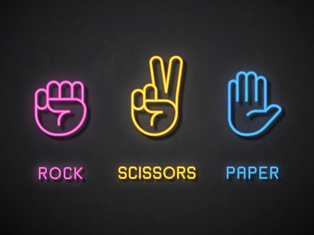

# Rock Paper Scissors Game with Python

Pick your weapon and play against the computer - you'll only get a virtual sting if you lose!

### Prerequisites

All you need is Python 3 to play.

### Usage
Clone the project, <code>cd</code> to your directory/download, and run the game.py file in a Python 3 shell (Terminal on a mac / Linux, Windows command prompt).

### Rules
Same as the classic game:

Paper covers Rock  Scissors cuts Paper  Rock smashes Scissors

Choose your weapon wisely!

Built with Python 3

Enjoy!

### License 
MIT

## Contributing

1. Fork it!
2. Create your feature branch: `git checkout -b my-new-feature`
3. Commit your changes: `git commit -am 'Add some feature'`
4. Push to the branch: `git push origin my-new-feature`
5. Submit a pull request :D